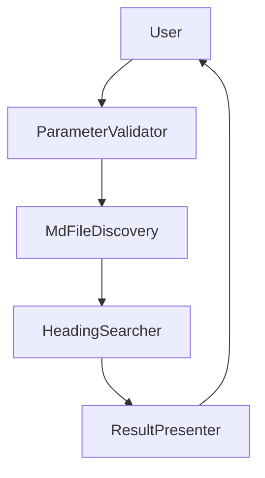
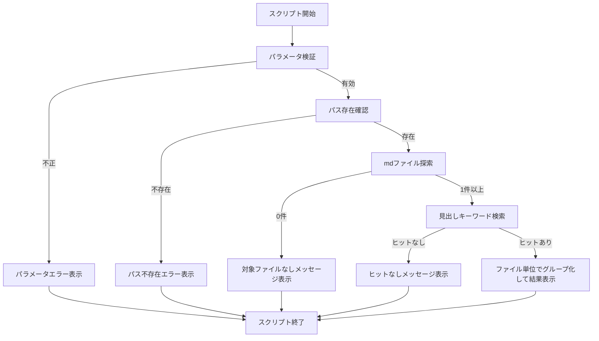

# Technical Design Document

## Overview
本機能は、指定フォルダ配下(サブフォルダを含む)のMarkdown(.md)ファイルから、`#`および`##`見出し(2階層まで)のテキストを対象にキーワード検索を行う、単一スクリプト構成のPowerShell製CLIツールを提供する。

**Purpose**: Markdownでノートやドキュメントを管理するユーザーに対し、ファイルを1つずつ開くことなく目的の見出しへ素早く到達できる検索手段を提供する。
**Users**: Markdownファイル群を管理するツール利用者が、`Search-MdHeading.ps1 -Path <フォルダ> -Keyword <文字列>` を都度実行して利用する。
**Impact**: 本リポジトリに新規のスタンドアロンスクリプトを追加するグリーンフィールドの変更であり、既存システムの変更は伴わない。

### Goals
- `#`/`##`見出し行のみを対象とした、大文字小文字を区別しない部分一致検索をフォルダツリー全体に対して正確に行う
- ファイル単位で判別可能な形式で、結果をコンソール画面にのみ表示する(ファイル出力なし)
- Windows PowerShell 5.1およびPowerShell 7+の両方で、追加モジュールなしに動作する
- 想定されるエラー条件(パラメータ不足、パス不存在、対象ファイルなし、ヒットなし)を、クラッシュではなく明確なメッセージで処理する

### Non-Goals
- `###`以降の見出しレベルや本文テキストの検索
- 正規表現検索・完全一致検索・あいまい検索などの追加検索モード
- 検索結果のファイル出力(CSV/JSON等)や構造化フォーマットでのエクスポート
- GUIやインタラクティブなTUI体験の提供

## Boundary Commitments

### This Spec Owns
- `-Path`/`-Keyword`のCLIパラメータ解析と検証
- 指定パス配下の再帰的な`.md`ファイル探索
- レベル1/レベル2見出し行の検出と、キーワードに対する大文字小文字を区別しない部分一致判定
- ファイルごとにグループ化されたコンソール専用の結果表示、および対象ファイルなし/ヒットなし時のステータスメッセージ

### Out of Boundary
- レベル3以降の見出しや、見出し以外の本文コンテンツの検索
- 検索結果をファイルや他の出力先へ永続化すること
- 部分一致(大文字小文字非区別)以外の検索モード(正規表現、完全一致、あいまい検索等)の追加
- 見出し行の検出を超えたMarkdown構文の解析・検証(フロントマター、コードブロック内の`#`風の行など)

### Allowed Dependencies
- Windows PowerShell 5.1 / PowerShell 7+に標準搭載された組み込みコマンドレットおよび.NET正規表現エンジン
- 呼び出し時に指定されたパス配下のローカルファイルシステムへの読み取りアクセス

### Revalidation Triggers
- 出力項目の変更(行番号の追加、ファイル出力対応など)が必要になった場合、ResultPresenterの契約を再検証する
- 検索対象とする見出しレベルの範囲変更(`###`への拡張等)が必要になった場合、HeadingSearcherの一致ルールを再検証する
- サポート対象PowerShell最低バージョンの変更は、Technology Stackで前提としているコマンドレット/演算子の可用性に影響するため再検証する

## Architecture

### Architecture Pattern & Boundary Map
**Selected pattern**: 単方向のLinear Pipeline(検証 → ファイル探索 → 見出し検索 → 結果表示)。単発実行のCLIツールであり、永続状態や並行処理を持たないため、最小限の責務分割で十分。



**Architecture Integration**:
- Domain/feature boundaries: 「入力検証」「ファイル探索」「見出し検索」「結果表示」の4段階に責務を分離し、各段階は前段の出力のみに依存する一方向の依存関係を持つ
- Existing patterns preserved: 該当なし(グリーンフィールドの新規追加)
- New components rationale: 各段階を独立した関数として切り出すことで、単体テストの容易性とロジックの再利用性を確保する
- Steering compliance: `.kiro/steering/`が未整備のため、本設計はrequirements.mdの内容とPowerShell標準の慣例(承認済み動詞の使用、標準コマンドレットのみの利用)に基づく

### Technology Stack

| Layer | Choice / Version | Role in Feature | Notes |
|-------|------------------|-----------------|-------|
| CLI / スクリプトホスト | Windows PowerShell 5.1 および PowerShell 7+(PowerShell Core) | スクリプトの実行環境、パラメータバインディング | 追加モジュール不要。両エディションで利用可能な組み込み機能のみを使用 |
| ファイルシステムアクセス | `Get-ChildItem`(組み込みコマンドレット) | 指定パス配下の`.md`ファイルの再帰的探索 | `Microsoft.PowerShell.Management`に含まれ標準搭載 |
| テキスト検索 | `Select-String`と.NET正規表現(組み込み) | 見出し行の検出とキーワードの部分一致判定 | 既定で大文字小文字を区別しない。キーワードは`[regex]::Escape`でエスケープしリテラル一致とする |

## File Structure Plan

単一ファイルのCLIスクリプトとして実装する。承認済みPowerShell動詞`Search`を用いたVerb-Noun命名規則に従う。

### Directory Structure
```
./
└── Search-MdHeading.ps1   # エントリポイント: パラメータブロック、検証、探索、検索、結果表示の全機能を1ファイルに定義
```

内部構成(同一ファイル内の関数群、責務ごとに分離):
- `Test-SearchParameter` — パラメータ検証(Requirement 1)
- `Get-MdFile` — `.md`ファイルの再帰探索(Requirement 2)
- `Find-MatchingHeading` — 見出し検索とキーワード一致判定(Requirement 3)
- `Write-SearchResult` — コンソールへの結果表示(Requirement 4)
- スクリプトのトップレベル本体 — 上記関数を順に呼び出すオーケストレーション(Requirement 5)

## System Flows



**Key Decisions**: パラメータ検証とパス存在確認は検索処理の開始前に完了させ、いずれかが失敗した場合はファイルへ一切アクセスしない(Requirement 1.2〜1.4)。ファイル探索・見出し検索いずれの段階でも0件の場合は専用のメッセージを表示し、正常終了する(Requirement 2.3, 4.3)。

## Components and Interfaces

| Component | Domain/Layer | Intent | Req Coverage | Key Dependencies (P0/P1) | Contracts |
|-----------|--------------|--------|--------------|--------------------------|-----------|
| ParameterValidator | CLI入力検証 | `-Path`/`-Keyword`の必須指定・空文字列・パス存在を検証する | 1.1, 1.2, 1.3, 1.4 | なし(境界の起点) | Service |
| MdFileDiscovery | ファイルシステム | 指定パス配下の`.md`ファイルを再帰的に収集する | 2.1, 2.2, 2.3 | ParameterValidator(P0) | Service |
| HeadingSearcher | ドメインロジック | `#`/`##`見出し行を抽出し、キーワードと大文字小文字を区別せず部分一致判定する | 3.1, 3.2, 3.3, 3.4, 3.5 | MdFileDiscovery(P0) | Service |
| ResultPresenter | CLI出力 | 検索結果またはステータスメッセージをファイル単位でグループ化してコンソールへ表示する | 4.1, 4.2, 4.3, 4.4 | HeadingSearcher(P0) | Service |
| ScriptEntryPoint | CLIオーケストレーション | 上記コンポーネントを順に呼び出し、実行環境の非機能要件を満たす | 5.1, 5.2, 5.3 | 上記すべて(P0) | Service |

### CLI入力検証

#### ParameterValidator

| Field | Detail |
|-------|--------|
| Intent | `-Path`/`-Keyword`の必須指定・非空・パス存在を検索開始前に検証する |
| Requirements | 1.1, 1.2, 1.3, 1.4 |

**Responsibilities & Constraints**
- `-Path`と`-Keyword`が共に指定され、かつ空文字列でないことを確認する
- `-Path`が既存かつアクセス可能なディレクトリであることを確認する
- いずれかの検証に失敗した場合、ファイルアクセスが発生する前に終了エラーを送出する

**Dependencies**
- なし(パイプラインの起点であり、他コンポーネントに依存しない)

**Contracts**: Service [x] / API [ ] / Event [ ] / Batch [ ] / State [ ]

##### Service Interface
```powershell
function Test-SearchParameter {
    param(
        [string] $Path,
        [string] $Keyword
    )
    # 戻り値なし。検証に失敗した場合は説明的なメッセージを持つ終了エラーを送出する。
}
```
- Preconditions: `$Path`と`$Keyword`は、スクリプトのパラメータブロックからバインドされた生の値である(`Mandatory`属性は付与しない)。
- Postconditions: 関数が正常に戻るのは、`$Path`が既存ディレクトリを指し、`$Keyword`が非空文字列である場合のみ。
- Invariants: 検証以外の副作用を持たない。ファイル内容の読み取りは行わない。

**Implementation Notes**
- Integration: スクリプト本体は`-Path`/`-Keyword`を`Mandatory`にせず宣言し、代わりに本関数で検証する(対話的な値入力プロンプトを避けるため。詳細は`research.md`のDesign Decisionを参照)。
- Validation: 「未指定または空」「パス不存在」を別メッセージとして区別し、要件1.2/1.3/1.4のメッセージ内容の違いを反映する。
- Risks: なし(単純な事前条件チェック)。

### ファイルシステム

#### MdFileDiscovery

| Field | Detail |
|-------|--------|
| Intent | 検証済みパス配下の`.md`ファイルを再帰的に収集する |
| Requirements | 2.1, 2.2, 2.3 |

**Responsibilities & Constraints**
- 指定パス配下をサブフォルダの深さに関わらず再帰的に走査する
- 拡張子が`.md`であるファイルのみを収集し、ディレクトリは含めない
- 該当ファイルが1件もない場合は空のコレクションを返す(呼び出し元がメッセージ表示を担当)

**Dependencies**
- Inbound: ParameterValidator — 検証済みの`$Path`を受け取る(P0)

**Contracts**: Service [x] / API [ ] / Event [ ] / Batch [ ] / State [ ]

##### Service Interface
```powershell
function Get-MdFile {
    param(
        [string] $Path
    )
    # 戻り値: [System.IO.FileInfo[]]
}
```
- Preconditions: `$Path`は存在し読み取り可能なディレクトリである。
- Postconditions: 再帰的に見つかったすべての`.md`ファイルを返す。該当なしの場合は空配列を返す。
- Invariants: ファイル内容には関与せず、拡張子と所在のみで判定する。

**Implementation Notes**
- Integration: `Get-ChildItem -Path $Path -Recurse -File -Filter *.md`を使用し、プロバイダーレベルで拡張子フィルタリングを行うことで、大量ファイル探索時の性能を確保する(`research.md`参照)。
- Validation: 該当なし(呼び出し元が0件判定を行う)。
- Risks: なし。

### ドメインロジック

#### HeadingSearcher

| Field | Detail |
|-------|--------|
| Intent | 各ファイルの`#`/`##`見出し行を抽出し、キーワードとの大文字小文字を区別しない部分一致を判定する |
| Requirements | 3.1, 3.2, 3.3, 3.4, 3.5 |

**Responsibilities & Constraints**
- 行頭(CommonMarkのATX見出し仕様に準拠し、見出し記号の前に最大3文字までの半角スペースインデントを許容する)が`#`(レベル1)または`##`(レベル2)で始まる行のみを見出し行として扱う
- `###`以降の見出し行、4文字以上のインデントを持つ行(CommonMark上コードブロック扱いとなるため)、および見出し以外の本文行を対象から除外する
- 見出しテキスト部分(先頭の`#`記号と直後の空白を除いた文字列)に対してキーワードが部分一致するかを判定する
- キーワード比較は常に大文字小文字を区別しない

**Dependencies**
- Inbound: MdFileDiscovery — 検索対象ファイルの一覧を受け取る(P0)

**Contracts**: Service [x] / API [ ] / Event [ ] / Batch [ ] / State [ ]

##### Service Interface
```powershell
function Find-MatchingHeading {
    param(
        [System.IO.FileInfo] $File,
        [string] $Keyword
    )
    # 戻り値: [PSCustomObject[]] (FilePath, HeadingLevel, HeadingText, LineText を持つ)
}
```
- Preconditions: `$File`は存在し読み取り可能なテキストファイルである。`$Keyword`は非空文字列である。
- Postconditions: キーワードに一致する見出し行ごとに1件の結果オブジェクトを返す。一致がない場合は空配列を返す。
- Invariants: `#`/`##`(先頭が3つ以上の`#`ではない行)のみを評価対象とする。見出し記号の前に最大3文字までの半角スペースインデントを許容する(CommonMarkのATX見出し仕様に準拠)。比較は常に大文字小文字を区別しない。

**Implementation Notes**
- Integration: `Get-MdFile`から得た`FileInfo`オブジェクトを`Select-String -Pattern $pattern`へパイプで渡す(`$File | Select-String -Pattern $pattern`)。ファイルパス文字列を`-Path`パラメータへ直接渡すと、`Select-String`がワイルドカードとして再展開するため、`[`や`]`を含むファイル名で検索漏れが起きる(`Select-String`には`-LiteralPath`が存在しない)。パイプ経由で`FileInfo`を渡すことでこの問題を回避する(`research.md`参照)。
- Integration: `$pattern`は名前付きキャプチャグループを用いて`^\s{0,3}(?<hashes>#{1,2})(?!#)\s+(?<text>.*KEYWORD.*)$`の形で構成する(`KEYWORD`は`[regex]::Escape($Keyword)`でエスケープした文字列)。マッチした`MatchInfo`から、`HeadingLevel`は`hashes`グループの値の文字数、`HeadingText`は`text`グループの値、`LineText`は`$match.Line`としてそれぞれ導出する。これによりファイル全体を変数へ読み込まずに行単位で検索できる(`research.md`参照)。
- Validation: キーワードは正規表現メタ文字として解釈されないよう、パターン組み立て前に必ずエスケープする。
- Risks: 見出し記号直後にスペースがない行(例: `#見出し`)は見出しとして検出されない。標準的なMarkdown構文に準拠した既知の制限として扱う(`research.md`のRisks参照)。

### CLI出力

#### ResultPresenter

| Field | Detail |
|-------|--------|
| Intent | 検索結果、またはファイル/ヒットなしのステータスメッセージを、ファイル単位で判別可能な形式でコンソールへ表示する |
| Requirements | 4.1, 4.2, 4.3, 4.4 |

**Responsibilities & Constraints**
- 各ヒットについて、ファイルパス・見出し階層とテキスト・見出し該当行のテキストを画面に表示する
- 結果をファイルへは一切出力せず、標準出力(コンソール画面)のみに書き込む
- 全ファイルを通じてヒットが1件もない場合は、その旨のメッセージを表示する
- 複数ファイルにまたがる結果は、どのヒットがどのファイルに属するか判別できる形式(ファイルごとのグループ化)で表示する

**Dependencies**
- Inbound: HeadingSearcher — 全ファイル分の検索結果を集約したコレクションを受け取る(P0)

**Contracts**: Service [x] / API [ ] / Event [ ] / Batch [ ] / State [ ]

##### Service Interface
```powershell
function Write-SearchResult {
    param(
        [PSCustomObject[]] $Result
    )
    # 戻り値なし。コンソール(ホスト/出力ストリーム)への書き込みのみを行う。
}
```
- Preconditions: `$Result`は全ファイルを通じた検索結果の集約コレクションである(空の場合もある)。
- Postconditions: `$Result`が空の場合はヒットなしメッセージを1件表示する。非空の場合は`FilePath`でグループ化し、ファイルごとに見出し情報を表示する。
- Invariants: ファイルへの書き込みは行わない。コンソール/出力ストリームへの表示のみ。

**Implementation Notes**
- Integration: `$Result`を`FilePath`で`Group-Object`し、ファイルパスを見出し行として1回表示した後、そのファイルに属する各ヒット(見出し階層・見出しテキスト・該当行テキスト)をインデントして表示する。
- Validation: 該当なし。
- Risks: なし。

### CLIオーケストレーション

#### ScriptEntryPoint

| Field | Detail |
|-------|--------|
| Intent | パラメータ検証・ファイル探索・見出し検索・結果表示を順に実行する、スクリプトのトップレベルフロー |
| Requirements | 5.1, 5.2, 5.3 |

**Responsibilities & Constraints**
- `Search-MdHeading.ps1`の`param()`ブロックとトップレベルのスクリプト文そのものであり、独立した関数は持たない
- 上記4コンポーネントを順に呼び出すのみで、独自のビジネスロジックは持たない
- 外部モジュールのインポートを行わない(組み込みコマンドレットのみ使用)

**Dependencies**
- Outbound: ParameterValidator(P0)、MdFileDiscovery(P0)、HeadingSearcher(P0)、ResultPresenter(P0)

**Contracts**: Service [x] / API [ ] / Event [ ] / Batch [ ] / State [ ]

**Implementation Notes**
- Integration: 各コンポーネントを`System Flows`の順序どおりに呼び出す。
- Validation: 該当なし(各コンポーネントが自身の検証を担当)。
- Risks: なし。

## Data Models

### Logical Data Model
検索結果はデータベースやファイルに永続化されるものではなく、スクリプトの単一実行内でのみ存在するインメモリのコレクションである。

**構造定義**:
- 各ヒットは以下のフィールドを持つ`PSCustomObject`として表現する

| Field | Type | Description |
|-------|------|--------------|
| FilePath | string | ヒットしたファイルのフルパス |
| HeadingLevel | int(1または2) | 見出しの階層(`#`または`##`) |
| HeadingText | string | 見出し記号と直後の空白を除いた見出しテキスト |
| LineText | string | 見出し行の生のテキスト(見出し記号を含む) |

**Consistency & Integrity**:
- 全フィールドはスクリプト実行中に一度だけ生成され、実行終了とともに破棄される(永続化なし)
- `HeadingLevel`は`LineText`先頭の`#`の個数から一意に導出され、常に1または2のいずれかである

## Error Handling

### Error Strategy
本ツールはCLIスクリプトであり、ユーザー起因の入力エラー(パラメータ不足、パス不存在)と、検索結果が0件であるという正常だが情報提供が必要な状態を区別して扱う。いずれの場合も、スクリプトはクラッシュ(未処理例外によるスタックトレース表示)せず、意図的に用意されたメッセージを表示して終了する。

### Error Categories and Responses
**User Errors**:
- `-Path`/`-Keyword`未指定または空文字列 → ParameterValidatorが該当箇所を示す終了エラーメッセージを表示し、以降の処理を実行しない(Requirement 1.2, 1.4)
- `-Path`で指定したフォルダが存在しない → ParameterValidatorがパス不存在を示す終了エラーメッセージを表示し、以降の処理を実行しない(Requirement 1.3)

**該当なしの状態(異常ではない)**:
- 対象フォルダ配下に`.md`ファイルが存在しない → MdFileDiscoveryの結果が空であることをScriptEntryPointが検知し、該当ファイルなしメッセージを表示して正常終了する(Requirement 2.3)
- 検索対象ファイルはあるがキーワードにヒットする見出しがない → HeadingSearcherの集約結果が空であることをResultPresenterが検知し、ヒットなしメッセージを表示して正常終了する(Requirement 4.3)

### Monitoring
本ツールはCLIの単発実行スクリプトであり、外部監視基盤との統合は範囲外とする。エラー・ステータスメッセージはすべてコンソールへの表示のみで完結する。

## Testing Strategy

- **Unit Tests(Pester)**:
  - `Test-SearchParameter`が、`-Path`/`-Keyword`の未指定・空文字列・パス不存在の各ケースを正しく拒否し、有効な入力を受け入れることを確認する
  - `Find-MatchingHeading`が、`#`/`##`行のみを一致対象とし、`###`および本文行を除外することを確認する
  - `Find-MatchingHeading`が、大文字小文字を区別せずに部分一致することを確認する
  - `Find-MatchingHeading`が、キーワードに正規表現特殊文字(`.`, `*`, `[`等)が含まれる場合でもリテラル文字列として一致判定することを確認する
- **Integration Tests**:
  - サブフォルダを含むフィクスチャ用フォルダツリーに対してスクリプト全体を実行し、期待どおりの集約結果が得られることを確認する
  - `.md`ファイルはあるがヒットなしのフォルダに対して実行し、ヒットなしメッセージが表示されることを確認する
  - `.md`ファイルが存在しないフォルダに対して実行し、対象ファイルなしメッセージが表示されることを確認する
- **Performance(非公式確認)**:
  - 大量(例: 1000件以上)の`.md`ファイルを含むフィクスチャツリーに対して実行し、実用的な時間内(数秒程度)に完了することを確認する

## Performance & Scalability
- **Target**: 数千件規模の`.md`ファイルを含むフォルダツリーに対して、スクリプトの処理オーバーヘッドではなくディスクI/Oが支配的な時間となる範囲で完了する
- **Approach**: ファイル探索は`Get-ChildItem -Recurse -File -Filter *.md`によりプロバイダーレベルでフィルタリングし、見出し検索は`Select-String`によりファイルパスへ直接行単位のストリーミング検索を行うことで、ファイル内容全体をメモリに保持しない構成とする
